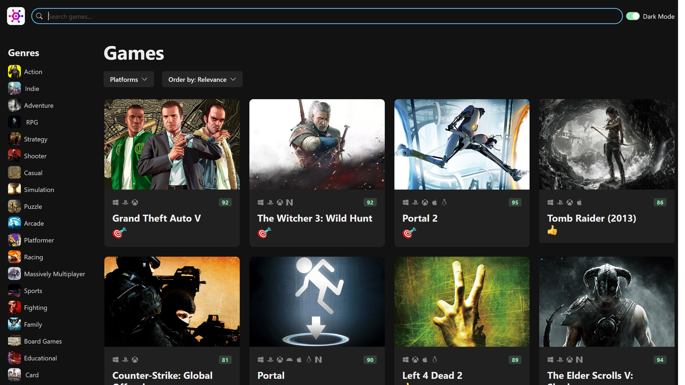
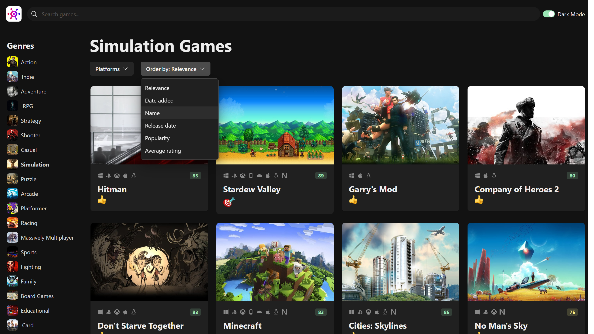
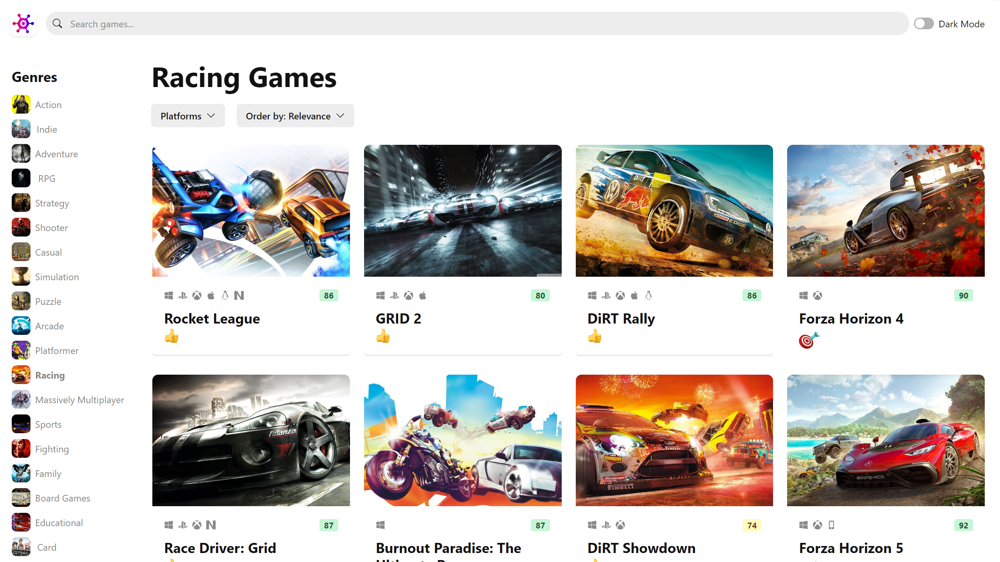
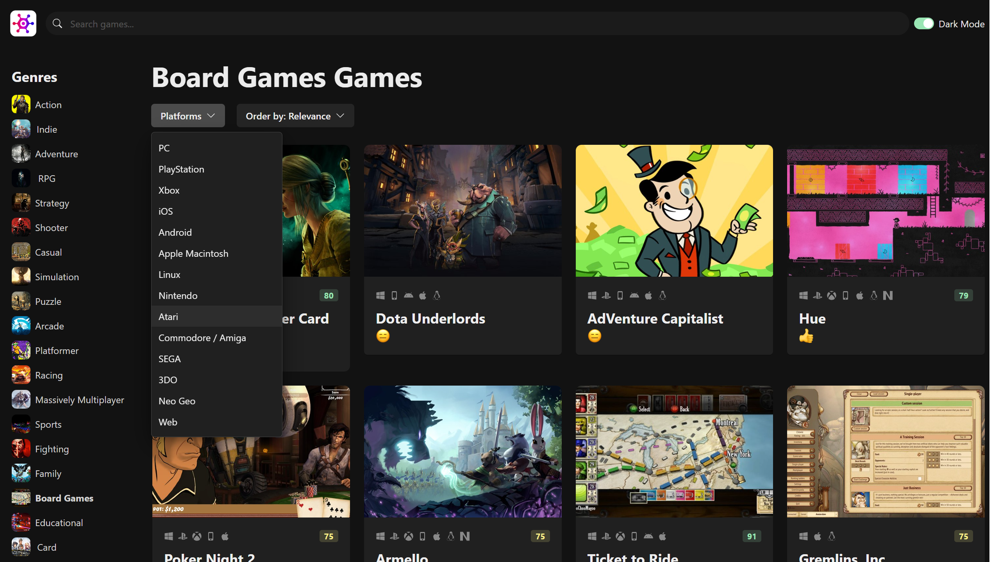
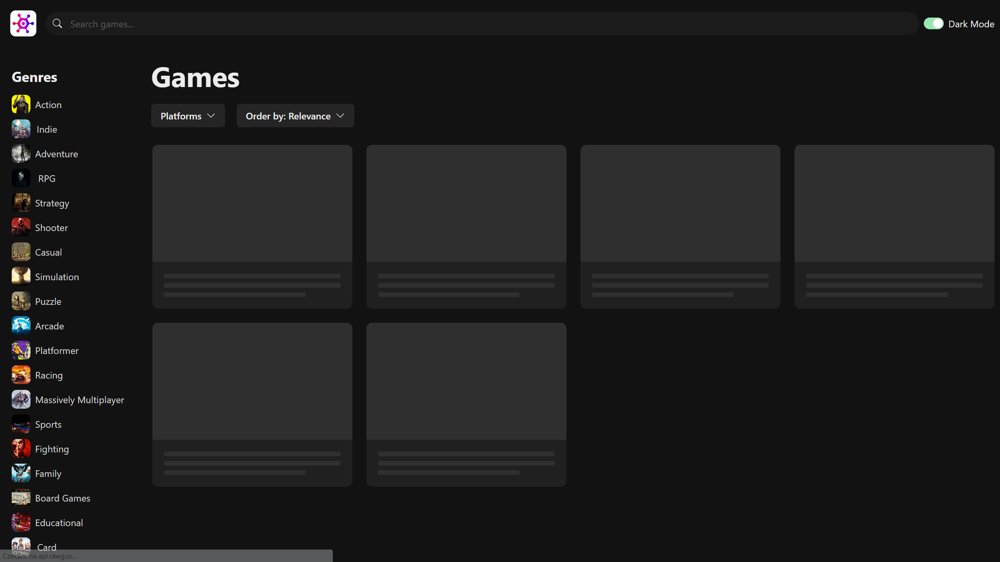

# GameHub

## Screenshots

    </img>
     
    </img>
     
    </img>
     
    </img>
     
    </img>

## Description

- **Mobile first strategy used!**
- Website contains many Games from different platforms!
- GameHub will help you find perfect game for You! The only thing you need to do is choos platform and genres!
- You can search for a game using searchbar.
- Each game is a dedicated card. On the card, You can see the rate of the game, full name, platforms that are avaliable (icons) and type.
- Left panel is the Genres. Click on the genre that suits You and find games.

#### Technology used:
- HTML, CSS, JS
- **Framework:** Bootstrap
- **Framework:** React
- Vite
- API (from )

## What I Learned

- Using most important **SEO tags** in modern websites.
- Using SCSS in a bigger project with many classes.
- Creating, importing and using Mixins.
- Creating hero-images and sliders of images.
- Creating semi-advanced animations to the cards, buttons and navigation popup.
- Destructuring website to the small components.
- Creating nav button that changes its color depending on the background on which it is located.

## Author info

- **Name:** Filip Bereszyński
- **Age:** 21 years old
- **Contact:**
    - bereszynski.filip@gmail.com
    - (+48) 510 240 074